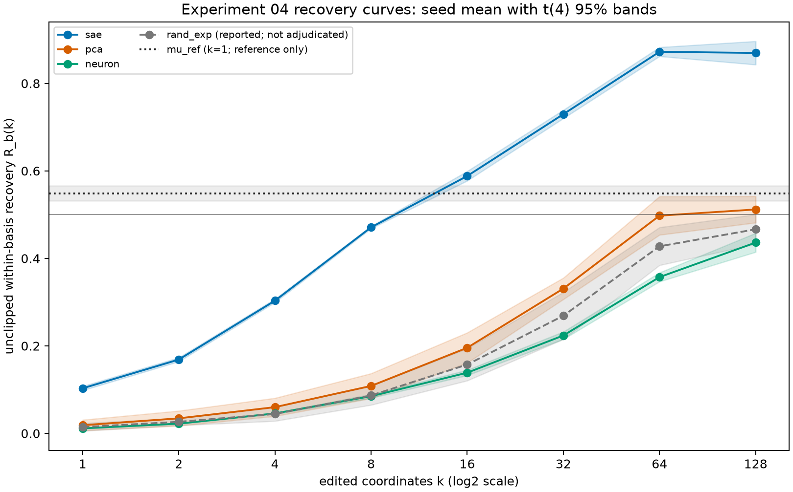
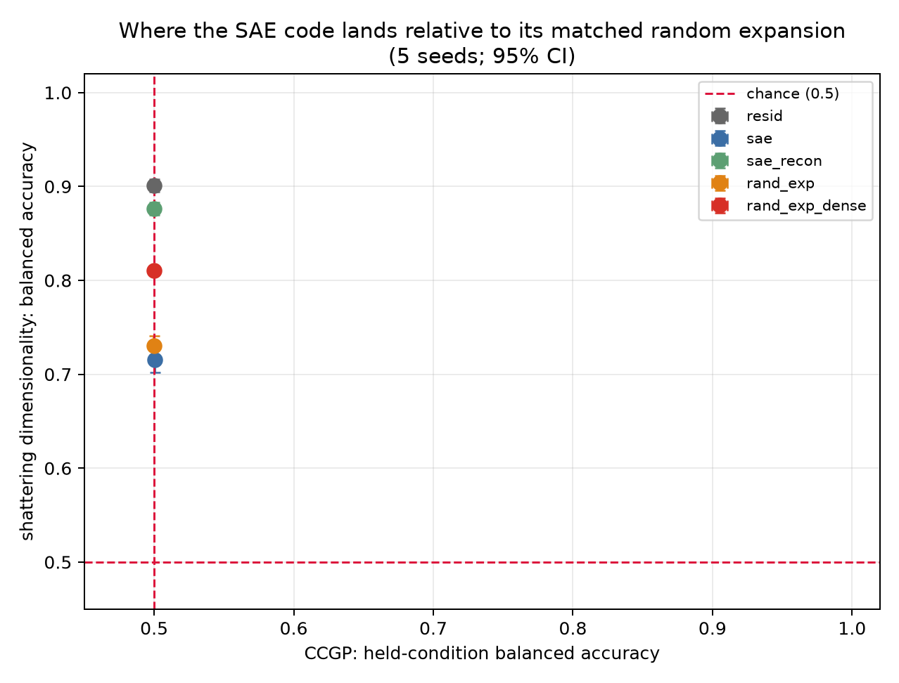
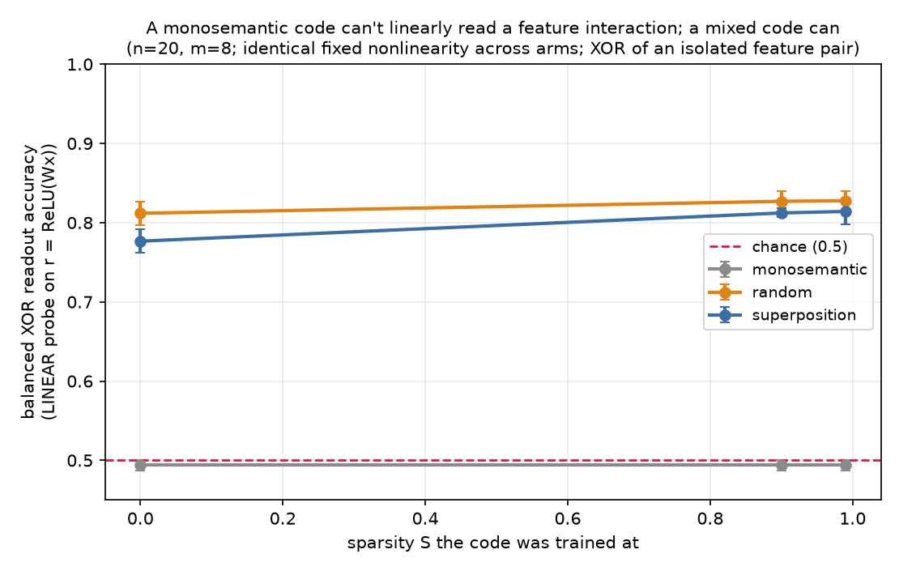
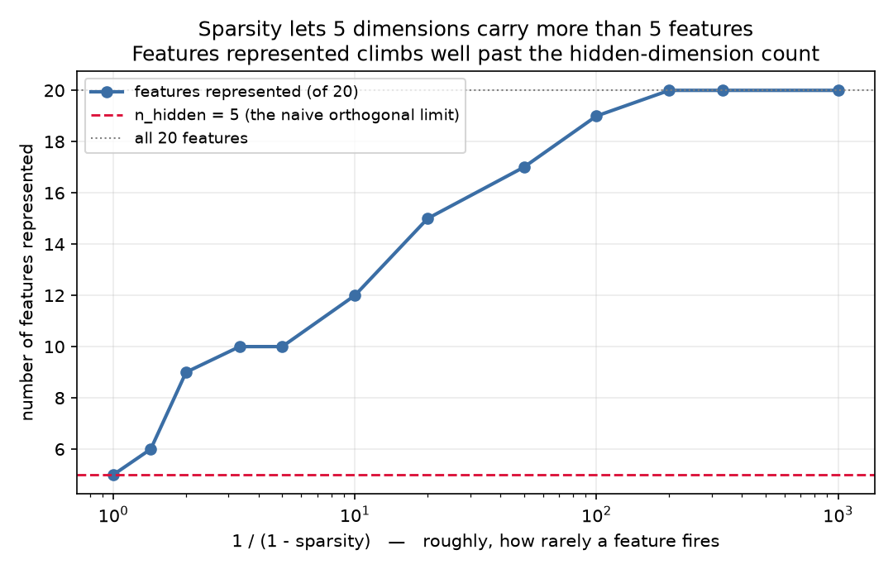

# mech-interp-lab

Self-directed mechanistic-interpretability research, run from a computational-neuroscience starting
point (probabilistic inference, stochastic modeling, primate V1 electrophysiology). CPU-only and
reproducible end to end.

The through-line is not a thesis but an **escalation of method**, and every step was forced by the
previous step's failure rather than planned in advance: *toy models where the ground truth is fully
observable → a real model read correlationally → the same question asked causally → the mechanism
itself.*

Four experiments, and a fifth whose design is frozen and whose main run has not started. The first replicates the *storage* account of
superposition. The second tests whether the same geometry also has a *computation* account and finds
that it does — under a nonlinearity held fixed across arms, a monosemantic code reads a feature
interaction at `0.494 ± 0.005` — on the chance line and provably unable to leave it, while mixed codes
reach `0.81`. (The interval sits a hair below 0.50 rather than astride it: the theorem forbids
performance *above* chance, and a fitted probe scoring slightly under it on held-out data is the
expected finite-sample behaviour, not a violation.) The third takes that question to real SAE features
on GPT-2-small and **fails to settle it** — the answer moved by more than tenfold under a rescaling a
fitted probe is not invariant to, and that is reported as unsettled rather than dressed up. The fourth
removes the failed instrument entirely, intervening causally so that the rescaling cannot move the
measure at all — and then **declines to certify what it measured**, because a faithfulness threshold
frozen in an earlier commit than any of this experiment's output was missed by 0.006. Most of these
produced results I did not want; all of them are reported in full.

[Experiment 05](experiments/05_number_agreement_circuit/DESIGN.md) is the next step of that escalation
and asks the mechanism question the first four could not: which attention heads move the number signal,
and do the twelve SAE latents that recurred across every experiment 04 seed lie on that causal path.
Its design is **frozen** — decision rules, thresholds, and the boundary sentences for near-threshold
outcomes are all committed — and the main run has not started. The only thing that has run is a
calibration pilot restricted to residual-stream measurements, so the design was frozen on evidence
about the stimuli rather than about the answer.

**A note on the framing this repository started with.** Experiments 01 and 02 were built around
superposition versus mixed selectivity — whether many features sharing few non-orthogonal directions is
a problem to undo or a computation to explain. That question is background here, not the organising
story, and the record is why: by experiment 03 the quantity actually being measured had become *SAE
basis quality*, a different and far more crowded question. Keeping the original banner would have been
framing rather than navigation.

---

## Experiment 04 — the causal version, and a gate that refused to certify a result I liked

[Full writeup](experiments/04_causal_feature_interchange/writeup.md) · [pre-registration, plus three dated amendments and one correction — the last amendment written after unblinding and non-adjudicating, the correction retracting three claims in the frozen text](experiments/04_causal_feature_interchange/DESIGN.md) · [code](experiments/04_causal_feature_interchange/run_experiment.py) · [raw results](experiments/04_causal_feature_interchange/run_results.json)

Experiment 03 stalled because a linear probe's L2 penalty is not invariant to rescaling its inputs, so
the answer moved with a preprocessing choice. The fix is not a better probe. It is no probe: edit
coordinates of a code, write the edit back into GPT-2-small's residual stream, and let **the model's own
next-token logits** report the effect. Rescale the code by a positive diagonal and the decoder inversely
and the written edit is algebraically unchanged — the knob that made experiment 03 unanswerable is
exactly zero here. The implementation asserts one instance of that with `torch.equal`, bit-for-bit, in
the pilot and in the main run.

The task is subject–verb number agreement on single-flip minimal pairs. The control is **PCA** of the
same activations — equally unsupervised, same kind of data, without the sparse dictionary-learning
objective. It is not otherwise matched, and every difference favours the SAE: 768 components against
24,576 latents, and one 8,192-token fit per seed against a dictionary trained on a corpus larger by many
orders of magnitude.
(The originally planned control, a width/norm/L0-matched random expansion, failed its own faithfulness
gate; a diagnostic quadrupled its fitting budget and the number moved the wrong way, which is the
pre-declared trigger for calling the failure structural rather than a fitting artifact — a rule's label
for a two-point outcome, not a proof about where the curve asymptotes — and the control changed family. All of that is in the amendments, each committed before the commit containing the output it
governs — commit order, which is not the same as proof of read order, and the writeup says so.)



| basis | AUC, within-basis | AUC, absolute | `k50` per seed |
|---|---:|---:|---|
| `sae` | **0.517 ± 0.002** | **0.359 ± 0.007** | 16, 16, 16, 16, 16 |
| `pca` | 0.213 ± 0.023 | 0.213 ± 0.023 | 64, 128, —, 128, 64 |
| `rand_exp` | 0.179 ± 0.024 | 0.117 ± 0.016 | never reached |
| `neuron` | 0.157 ± 0.005 | 0.157 ± 0.005 | never reached |

**The frozen rule returns `inconclusive`, so nothing in that table is a claimed result.** Gate C requires
each adjudicated basis to write back at least `0.70` of the residual-stream effect; the SAE's trained
decoder measured `0.694 ± 0.014`, passing in two seeds of five, and the design says a basis that fails
Gate C yields no headline. I did not move the threshold. Checking afterwards, moving it would not have
worked anyway — a second gate blocks independently in one seed.

What the table *is*: an uncertified measurement, reported in full because hiding it would be worse.
Sixteen SAE coordinates reach half of that basis's causal effect in every seed while PCA needs 64 to 128
and once never gets there; the paired gap is `+0.304 ± 0.023` within-basis and `+0.146 ± 0.022` absolute,
positive in all five seeds under both denominators.

The obvious deflations are tested rather than waved off, all post-hoc and recomputable from the manifest:
restricting to pairs whose subject noun never appears in the ranking-training split moves the number by
`+0.0054` (`0.5936` against `0.5882`, on 150 edits, with no equivalence test), and the five seeds' top-16
latents share a 12-latent intersection. The matched random expansion — same nominal 24,576-wide pool,
same pre-filter, same ranking rule — finishes *last*, which points away from a pure pool-width story
without settling it, since that arm failed Gate C too. The 32× width advantage stays a live alternative
reading. What keeps the whole thing honest-sized: a single **supervised** direction recovers `0.549` on
its own while the SAE's best single latent recovers `0.072`. Among the 128 candidates scored in each
unsupervised basis, none puts this factor in one coordinate.

### The by-product that became the next experiment

The design's causal-handle check swept layers × positions, and the picture is the cleanest thing in the
run. `E_resid/d_gap`, five seeds:

| layer | subject position | final position |
|---|---:|---:|
| 4 | 0.662 ± 0.012 | 0.011 ± 0.002 |
| 8 | 0.366 ± 0.015 | 0.423 ± 0.006 |
| 10 | 0.260 ± 0.014 | 0.694 ± 0.012 |

At layer 4 the causal handle for number sits almost entirely on the subject; by layer 10 it has largely
arrived at the readout position. **What is measured is where an interchange has an effect — no attention
pattern, head, or path was measured**, so this is consistent with the signal being relocated and is not
evidence about what relocates it. That gap is exactly what [experiment
05](experiments/05_number_agreement_circuit/DESIGN.md) is for.

### Scope — what this does not say

The model is never modified: the base residual is left exactly as GPT-2 produced it and one vector is
added to it, so no reconstruction is ever substituted for the model's own state. (The *difference* of
reconstruction errors does not cancel — an earlier draft said it did, and that was wrong; had it
cancelled, Gate C's ratio would be 1, and it is 0.694.) Low recovery in a basis means a factor is not concentrated
in few coordinates of that basis — never that an SAE harms a model's computation.

---

## Experiment 03 — a real SAE on the shattering × CCGP plane, and a result I had to give back

[Full writeup](experiments/03_ccgp_on_sae_features/writeup.md) · [code](experiments/03_ccgp_on_sae_features/ccgp_sae.py) · [per-seed results](experiments/03_ccgp_on_sae_features/results.json)

Experiment 02's caveats named this one twice: XOR accuracy is a task-specific proxy where shattering
dimensionality / CCGP (Bernardi et al. 2020) is the task-agnostic measure, and the whole thing was a toy
model. So this one is measured on a real model, with SAE weights I did not train: GPT-2-small layer 8 and
the published res-jb SAE from `jbloom/GPT2-Small-SAEs-Reformatted`, loaded straight from safetensors. Then
a full factorial NUMBER × TENSE × POLARITY over 96 lexical items, read at a sentence-final `.` that is
byte-identical across all eight conditions. The comparison that matters is
not SAE versus residual stream — a 768 → 24,576 ReLU expansion wins that by Cover's theorem — but **SAE
versus a random expansion matched in width, column norm, and L0.**



Under one probe convention the SAE reads two-way interactions much better than matched random mixing
(`+0.121 ± 0.015`); under another it does not (`+0.011 ± 0.022`). Those two conventions are an **invertible
affine reparameterisation** of a linear probe's input, so the swing measures the probe's inductive bias,
not the codes. **I report that as not adjudicated** rather than shipping the flattering setting — and the
width-matched follow-ups that survived (`+0.081 ± 0.008`, `+0.075 ± 0.016`) inherit the same question,
because they only ever ran under the convention that produces an effect.

Per arm, in overall shattering dimensionality (five seeds, 95% Student-t):

| arm | per-feature z-score | global RMS |
|---|---:|---:|
| `sae` (sparse; ~790 latents ever fire here) | 0.718 ± 0.020 | 0.888 ± 0.006 |
| `rand_exp` (matched random; ~500) | 0.731 ± 0.014 | 0.809 ± 0.008 |
| `resid` (768, dense) | 0.901 ± 0.009 | 0.902 ± 0.009 |
| `sae_recon` (768, dense) | 0.877 ± 0.010 | 0.877 ± 0.009 |

What does survive is a methodological result, and it is the part I'd defend: the sensitivity is
**localised**. The two dense 768-dimensional arms are unmoved by the scaling (0.902 vs 0.901; 0.877 vs
0.877) while every sparse or very wide arm swings hard — so preprocessing that is harmless for dense
representations is decisive for sparse over-complete ones, and any SAE-versus-baseline decoding comparison
that doesn't state its scaling convention is under-determined.

This is a fallback report, and the writeup says so in full. The run that would settle the comparison in
full — every headline arm and both metrics fitted to a stated convergence criterion, with L2 selected per
arm *and* per scaling — did not complete in time for the shipped manifest, so what ships is the earlier
completed run. The question counts as adjudicated only when both scaling estimates are individually
precise *and* agree, not merely when their intervals overlap.

### Final state — the convergence test ran, and the answer is still no

A follow-up [convergence test](experiments/03_ccgp_on_sae_features/convergence_test.py) did run that
criterion for shattering dimensionality on the four shared arms: full-batch L-BFGS with strong-Wolfe line
search, stopped on a stated relative-objective criterion rather than a step count, with L2 selected
item-disjointly per arm, per scaling, per seed, and per fold
([raw rows](experiments/03_ccgp_on_sae_features/convergence_results.json); 145 s of CPU). It closed about
half the discrepancy and did not close it — `+0.058 ± 0.041` under per-feature z-scoring against
`+0.115 ± 0.019` under global RMS. The predeclared rule asked for both estimates to be individually
precise *and* close; neither held, and a small overlap between a precise interval and an uninformative one
is not agreement. The dense-arm diagnostic passed (largest shift between scalings 0.0058), so the solver
is sound and what remains is the L2 prior's geometry, not a convergence artifact.

So experiment 03 stands as **an honest non-result with a defensible methodological finding beside it.**
Whether a real SAE code reads two-way interactions better than matched random mixing is a question this
probe family cannot answer, because the answer moves with a preprocessing choice that a linear probe
should be indifferent to. The lesson carried into the next design is that looking for the "fair" scaling
inside this family is most likely looking for a point that does not exist — the way forward is a question
setting where regularisation geometry is the object of study or is absent from the estimator, not one more
attempt to neutralise it.

### Scope — what this does not say

An SAE is a read-out lens beside the residual stream. Nothing here substitutes SAE features into GPT-2's
forward pass, ablates them, or measures model behaviour — so none of it says, or implies, that an SAE
harms a model's computation. These are properties of a code under a probe.

---

## Experiment 02 — a monosemantic code cannot linearly read a feature interaction; a mixed one can

[Full writeup](experiments/02_superposition_and_readout/writeup.md) · [code](experiments/02_superposition_and_readout/readout.py) · [per-seed results](experiments/02_superposition_and_readout/results.json)

The SAE lineage in interpretability treats superposed coding as something to undo — disentangle the
mixed directions so features can be enumerated. The mixed-selectivity literature in systems
neuroscience (Rigotti et al. 2013) treats the same geometry as *functional*: mixing is what buys a
linear readout the dimensionality it needs to compute nonlinear functions. Both can be true, and
interpretability is not blind to the second point — Elhage et al. study computation in superposition
directly. What a toy model adds is ground truth: I can build the geometries by hand and measure which
framing the readout actually rewards.

Three geometry arms at fixed `n = 20, m = 8`, differing **only** in the encoder `W` — monosemantic (a
selection matrix), random (Gaussian, Frobenius-norm-matched), and superposition (the frozen `W` that
experiment 01's storage objective learns). Each is read by a **linear** logistic probe on
`r = ReLU(W x)`, asked for the XOR of a feature pair. 8 seeds, balanced accuracy, a fixed
class-balanced eval distribution shared across every arm and sparsity, within-seed paired statistics.



| arm | XOR readout accuracy (across sparsity `S`) |
|---|---|
| monosemantic | **0.494 ± 0.005** at every sparsity — exactly on the chance line |
| random | 0.79 → 0.81 |
| superposition | 0.78 → 0.81 (dip to 0.74 at `S = 0.7`; the eight seeds split bimodally there) |

The monosemantic arm is a **theorem**, not a trained result: `XOR(a, b) = a + b − 2ab` needs the
product term `ab`, and `ab` is not in the span of `{1, f(a), g(b)}`, so no code with one feature per
unit can carry an interaction to a linear readout. I test the *strong* form of it — every XOR pair is
drawn only from the features the monosemantic arm actually represents, so its chance accuracy is the
theorem and not missing coverage. What the experiment adds on top of the theorem is the quantitative
ruler (how much mixing buys, against an equal-norm random control) and the fact that the nonlinearity
is held fixed across all three arms, so the manipulated variable is geometry alone. `ReLU(a single
feature)` is still additive and reads out no interaction; `ReLU(a mixture)` manufactures the
cross-terms. The probe's train-minus-test gap on the mixed arms is `+0.002`, so 0.80 is not
overfitting.

The interpretability-relevant reading: **an exactly monosemantic representation carries a
computational cost.** One feature per unit maximizes enumerability and, in that exact limit, leaves a
linear readout unable to see feature interactions at all. And the tradeoff is *not* the tidy one you
might expect — mean per-feature decodability is 0.621 for the superposed code versus 0.614 for the
monosemantic one, so mixing did not destroy enumerability here. The tension is the sharper version:
mixing is necessary to linearly read an interaction, and the most-enumerable limit provably cannot
read one at all.

### The null, stated plainly

Does the *storage-learned* geometry beat equal-norm random mixing? **No.** Within-seed paired
differences (superposition − random) are `−0.015 ± 0.017` at `distractor_p = 0`, `+0.004 ± 0.008` and
`+0.002 ± 0.005` with background activity; the 95% CIs include zero in essentially every cell. A
4-seed pilot had hinted at a small positive effect at high sparsity; **at 8 seeds it washed out, and I
am reporting the null rather than the pilot.**

That is a discriminating answer, not a failed run. The readout capacity comes from
mixing-plus-nonlinearity itself, not from the particular geometry experiment 01 learns: the storage
objective shapes *which* mixed geometry appears, but the computational benefit is a generic property of
mixing rather than something that geometry is optimized for. The headline above does not depend on this
— random mixing suffices; experiment 01 just supplies one storage-trained instance of a mixed code
whose ground truth I know.

### The probe design trap

My first instinct was the obvious one: run a linear probe directly on experiment 01's encoder,
`h = W x`. That design is **identically at chance for any geometry whatsoever** — a linear readout of a
linear projection is still linear in `x`, and XOR needs the interaction term. I would have gotten a
real null for an entirely boring reason, and the geometry question would have been untouched.

The fix is the actual content of the design: a nonlinearity is unavoidable, *and* it has to be held
constant across the arms. With `r = ReLU(W x)` fixed everywhere and only `W` varying, the result cannot
be "a nonlinearity lets you do XOR" (trivially true). It becomes the claim I wanted to test —
**geometry decides whether a linear readout can see the interaction.** The negative control (a
theorem-backed arm that must land at chance) is what makes the positive result readable at all.

### Scope — what this does not say

This is a claim about **representations**, not about SAEs as a tool. It does **not** say an SAE harms a
model's computation. An SAE is a readout lens alongside the residual stream: downstream components
still read the mixed residual stream, the SAE does not replace the model's representation with a
monosemantic basis, and this experiment does not measure that question at all. Also: a toy model, not a
transformer; XOR is one minimal interaction, not all computation; and this is compression
(`n → m`, `m < n`) whereas Rigotti's mixed selectivity is expansion — cousin geometries, opposite
dimension direction.

---

## Experiment 01 — the storage account, replicated

[Full writeup](experiments/01_toy_models_of_superposition/writeup.md) · [code](experiments/01_toy_models_of_superposition/toy_models.py)

A replication of Elhage et al., [*Toy Models of Superposition*](https://transformer-circuits.pub/2022/toy_model/index.html):
when features are sparse, a tied-weight ReLU autoencoder packs more features than it has dimensions,
storing them along non-orthogonal directions and tolerating interference between features that rarely
co-occur. Five features in two dimensions give
[the pentagon](experiments/01_toy_models_of_superposition/figures/01_feature_geometry_5x2.png) under
uniform importance and antipodal pairs under decaying importance — the geometry is set by the loss
landscape's symmetry, not by a fixed rule. Twenty features in five dimensions go from 7/20 represented
when dense to all 20/20 by `S ≈ 0.997`. (This is the one experiment that ships figures but no
machine-readable results file, so these two counts cannot be re-derived without rerunning it — a gap
noted here rather than papered over.)



The dimension count is a floor, not a ceiling. Per-feature dimensionality `Dᵢ` sums to an
effective-dimension upper bound that approaches `m` only when training uses the bottleneck fully:
superposition redistributes the available dimension budget rather than manufacturing new dimensions.
Single seed, and the integer "features represented" count jitters near the norm threshold — the
geometry and `Dᵢ` are the robust readouts, not the exact count.

This experiment supplies the object experiment 02 tests, and the bridge that motivates it: same
non-orthogonal mixing that systems neuroscience calls mixed selectivity, with the ground truth handed
to you.

---

## Next

- **[Experiment 05 — the number-agreement circuit](experiments/05_number_agreement_circuit/DESIGN.md)**,
  design frozen 2026-08-02, main run not started. Which attention heads carry the subject's number to the verb position, is
  what they carry *number* rather than any perturbation, does it arrive from the subject position, and
  do experiment 04's twelve recurring SAE latents span it. Four axes, each with two pre-declared
  verdicts, so no axis can return `inconclusive`; the latent question is adjudicated on seeds disjoint
  from the ones that selected those latents. No peer-reviewed head-level *causal* baseline exists for this
  task in GPT-2-small, which is checked and sourced in the design.
- Re-register experiment 04's Gate C on a decoder each arm actually ships with, with the floor
  pre-declared from a pilot on a *different* stimulus family so the threshold cannot be tuned to this
  one. Necessary but **not** sufficient: a rerun still has to clear every other frozen gate, and Gate D
  blocked independently in one seed.
- Close the PCA fitting-budget objection with a fit an order of magnitude larger, or with real corpus
  text instead of model-generated text. If experiment 04's comparison is wrong, this is where.
- A second stimulus family, before anything in experiment 04 generalises beyond number agreement — and
  independent template families for experiment 03 on the same principle.
- Shattering dimensionality / CCGP on experiment 02's three *toy* geometries — the same metric where
  the ground truth is fully known, which would calibrate what these numbers mean.
- A mechanism check on any residual superposition-versus-random effect: correlate each pair's margin
  with the Gram interference among its active features.

## Reproduce

Python 3.11 (torch has no 3.14 wheels yet). CPU-only. Experiments 01–02 need no downloads; experiments
03–05 need GPT-2-small and one ~150 MB res-jb SAE. Experiment 03 pulls them from the HuggingFace hub
on first run; experiments 04 and 05 reuse that cache rather than fetching it themselves.

```bash
python3.11 -m venv .venv && source .venv/bin/activate && pip install -r requirements.txt
```

```bash
(cd experiments/01_toy_models_of_superposition && python toy_models.py)   # ~1-2 min
```

```bash
(cd experiments/02_superposition_and_readout && python readout.py)        # ~10-15 min; SMOKE=1 for a ~40s subset
```

```bash
(cd experiments/03_ccgp_on_sae_features && python ccgp_sae.py)           # 19m51s measured on an M1 Pro CPU; SMOKE=1 gives a fast plumbing subset
```

```bash
(cd experiments/04_causal_feature_interchange && python pilot.py && python gate_c_diagnostic.py && python run_experiment.py && python robustness.py)
```

Experiment 04 is four stages in the order they were actually run — go/no-go pilot, the Gate C diagnostic
that redirected the control arm, the five-seed main run, and the post-unblinding robustness arms.
Measured on an M1 Pro CPU: 42.3 s + 647 s + 1,760 s + 1,344 s, **63.2 minutes total.**

Experiment 05 has no main run yet. Its
[pre-registration](experiments/05_number_agreement_circuit/DESIGN.md) is frozen, and the one thing that
has run is the calibration pilot that froze it:

```bash
(cd experiments/05_number_agreement_circuit && python calibrate.py)     # 101.8 s measured on an M1 Pro CPU
```

Each `experiments/NN_*/writeup.md` is self-contained: setup, results, controls, and what the result is
not. Experiment 04 additionally ships its
[pre-registration](experiments/04_causal_feature_interchange/DESIGN.md) with three dated amendments and a
dated correction that retracts three claims made in the frozen text. Each amendment commit precedes the
commit containing the output it governs — commit order, which is weaker than proof of when anything was
read, and the writeup says so.
[`lab-notebook.md`](lab-notebook.md) is the dated process record, including the traps I nearly
fell into and the pilot-versus-full-run story behind the null.
[`learning-roadmap.md`](learning-roadmap.md) is where this is going next.
