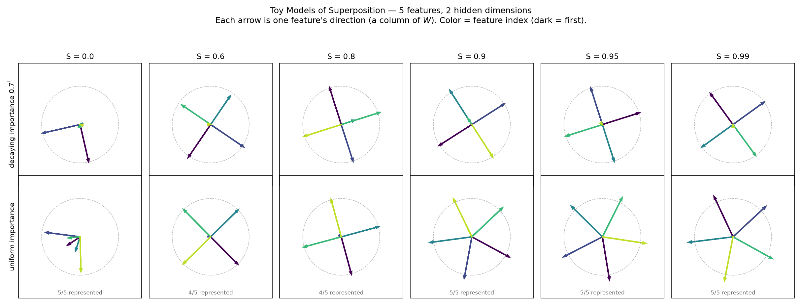
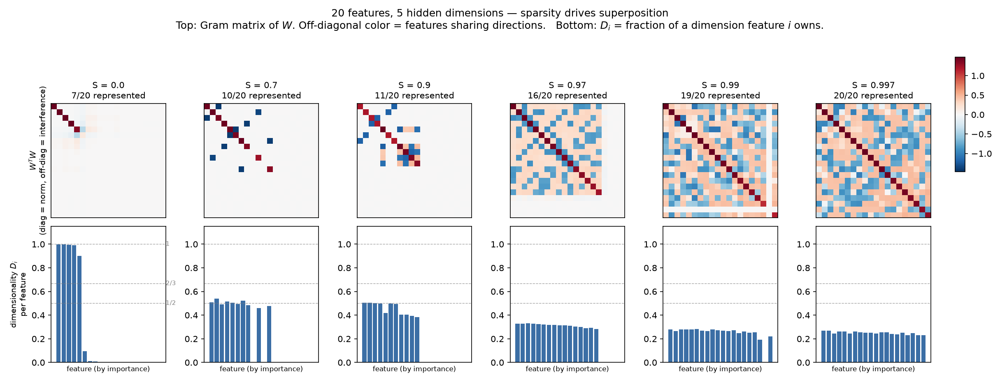

# Experiment 01 — Toy Models of Superposition

**Paper:** Elhage et al., *Toy Models of Superposition* (Anthropic, 2022) — https://transformer-circuits.pub/2022/toy_model/index.html
**Code:** `toy_models.py` (CPU, ~90s). **Figures:** `figures/`.

## The question

A network has fewer neurons than there are things worth representing. So what does it do — pick a privileged subset of features and drop the rest, or somehow pack more features than it has dimensions? The paper's answer: **when features are sparse, the network packs more features than dimensions into the same space**, storing them along non-orthogonal directions and tolerating interference between features that rarely co-occur. That's *superposition*.

This is the cleanest possible demonstration, and it's why it's my first experiment: no pretrained model, no GPU, pure synthetic data, and the central concept of the whole field falls out of a tiny tied-weight ReLU autoencoder (the 5→2 case has just 15 trainable scalars).

## Setup

`n` sparse features pushed through an `m`-dimensional bottleneck (`m < n`), reconstructed with a tied-weight ReLU decoder:

```
h  = W x                 # (n -> m)  compress
x' = ReLU(Wᵀ h + b)      # (m -> n)  reconstruct
```

Each input feature is zero with probability `S` (the sparsity), else uniform on [0, 1). Loss is importance-weighted MSE. Within a given sweep the swept variable is `S` (experiment 1 also compares two importance regimes; experiments 2–3 change model size and step count). The columns of `W` **are** the learned feature directions — read the geometry straight off the weights.

## What I ran and what came out

**1. Five features, two dimensions.** Two importance regimes side by side.



Caption — uniform sparse features form the pentagon; changing importance breaks that symmetry into protected axes and antipodal pairs.

- *Dense (S=0):* with **decaying** importance, only the top 2 of 5 features survive — the model keeps the two most important on near-orthogonal axes and drops the other three. (With **uniform** importance all five keep some norm, but reconstruction is poor: five directions crammed into two dimensions with no sparsity to hide the interference.) With no sparsity there is no free lunch. This is the "no superposition" baseline, and the decaying case is exactly the naive dimension-counting prediction.
- *Sparse, uniform importance:* at S=0.9–0.99 all five features appear as a **regular pentagon** — five equal vectors at 72°. This is the paper's iconic figure, reproduced. Five features living in two dimensions, none privileged, interference spread symmetrically.
- *Sparse, decaying importance:* the pentagon breaks. The model triages — protects the top features and pairs the rest into antipodal (180°) pairs. Same mechanism, different symmetry, driven entirely by the importance weighting.

The pentagon-vs-pairs contrast is the whole lesson in one image: **the geometry the model chooses is a function of the loss landscape's symmetry, not a fixed rule.**

**2. Twenty features, five dimensions.** Gram matrix `WᵀW` (top) and per-feature dimensionality `Dᵢ` (bottom) across the sparsity sweep.



Caption — higher sparsity produces more off-diagonal interference while many features share the same five-dimensional bottleneck.

- Dense: 7/20 features represented, sharp diagonal Gram matrix (near-orthogonal), and `Dᵢ ≈ 1` for the survivors — each owns a full dimension. No superposition.
- Sparse: the count climbs with sparsity — 19/20 at S=0.99, and **all 20/20 by S≈0.997** — with dense off-diagonal Gram structure (everyone interfering with everyone) and `Dᵢ ≈ 0.25` uniformly at the high-sparsity end: 20 features sharing 5 dimensions, each owning about a quarter.
- Across the sweep, `Σ Dᵢ` sits near `m = 5` once the bottleneck is well used. `Σ Dᵢ` is an **effective-dimension upper bound**: it is bounded above by `m` and gets close to `m` only when training fills the bottleneck (a random `W` gives ≈4.2; a representation that collapses into a 3-D subspace gives 3). Superposition redistributes that available dimension budget — from a few features each owning a whole dimension to many features each owning a fraction — rather than manufacturing new dimensions.

**3. Capacity vs sparsity.** Features represented against `1/(1−S)`.


Caption — representation capacity rises monotonically with sparsity, from the orthogonal limit of five to all 20 features.

Clean monotone climb from 5 (= `m`, the orthogonal limit, dashed red) at S=0 up to the full 20 as features get sparse. The dimension count is a floor, not a ceiling.

## Numbers (seed 0, deterministic)

| S | 5→2: uniform | 20→5: represented | 20→5: Σ Dᵢ |
|---|---|---|---|
| 0.0 | 5/5 (but orthogonal pairs, low fidelity) | 7/20 | 5.00 |
| 0.9 | 5/5 pentagon | 11/20 | 5.00 |
| 0.99 | 5/5 pentagon | 19/20 | 4.98 |
| 0.997 | — | 20/20 | 4.99 |

(Small run-to-run wobble in exact counts near the `>0.1` alive-threshold; the trend is stable.)

## The bridge — why a comp-neuro person should care

This is the compression-side analogue of **mixed selectivity**, with the ground truth handed to you — same non-orthogonal mixing, though a toy model packs *n* features into *m < n* dimensions whereas Rigotti's mixed selectivity expands a few task variables across many neurons (`experiments/02` takes up that distinction).

In primate cortex we constantly find single neurons that respond to combinations of task variables rather than one clean tuning dimension. In V1 the textbook story is one neuron ≈ one oriented Gabor, but the population reality is messier — cells multiplex, and normalization reshapes their joint tuning. The persistent question is whether that mixing is a nuisance (noise, incomplete sampling) or a computational choice (Rigotti et al. 2013 argue mixed selectivity buys the dimensionality a linear readout needs).

Toy Models is the same phenomenon in a system where you can settle the argument:

- The "neurons" (hidden units) are demonstrably polysemantic in these trained models — I can read the exact feature directions off `W` and watch them share axes.
- It looks like a solution the objective selects, not an accident: superposition emerges as sparsity rises, and at a given sparsity the learned superposed `W` reconstructs more features than an orthogonal-only code could (which caps at `m`). This is an empirical read on single-seed runs, not a formal optimality proof — and losses at different sparsities sit on different data distributions, so they are not directly comparable across the sweep.
- The controlling variable is feature **sparsity**, i.e. how often each latent cause is actually present. That maps directly onto natural-scene statistics — the sparsity of active latent causes in natural images is exactly the regime Olshausen & Field 1996 built sparse coding of V1 around. Same math object, two fields, thirty years apart.

**Two framings to hold together** (carried into `learning-roadmap.md`): SAE-based interpretability often treats superposition as something to *undo* — you disentangle the superposed directions in order to enumerate features. The same literature also studies computation carried out *in* superposition (Elhage et al. include a "Computation in Superposition" section), so this is not a blind spot the field missed. What the mixed-selectivity literature adds (Rigotti et al. 2013) is a sharp functional claim: this kind of geometry can *buy* the dimensionality a linear readout needs. A toy model with fully observable ground truth is a clean place to measure whether the superposed geometry actually helps or hurts a downstream readout — the thread `experiments/02` takes up.

## Caveats (honesty about what this is not)

- Toy model, not a transformer. It shows superposition *can* happen and *why*; it doesn't show that any particular real model represents features this way. Establishing that is a separate, harder question — the induction-head and IOI work later in the roadmap is about circuits and does not by itself prove GPT-2 uses this toy geometry.
- "Features represented" uses a hard norm threshold (0.1); near the threshold the integer count jitters between runs. The dimensionality `Dᵢ` and the geometry are the robust readouts, not the exact count.
- No seed sweep yet. Single seed (0). A natural next step is to check the pentagon is the reliable attractor and not one lucky basin.

## Next

- Finer sparsity grid + multi-seed to map the phase boundaries (paper's phase-diagram figures).
- Push to `m=2, n=6..8` and watch which regular polygons appear — the discrete geometric phases (`1/2, 2/3, ...` dimensionality plateaus) are the deep part of the paper.
- Then leave toy land: Week 1 of the roadmap, write a transformer forward pass and start on real activations.
