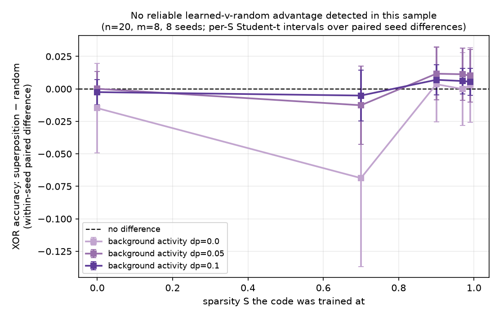

# Experiment 02 — Mixed codes make XOR easier for the shipped probe; coordinate-wise scores are nonseparable

**Code:** `readout.py` (CPU, ~10–15 min; `SMOKE=1` for a ~40s subset;
`REAGGREGATE_ONLY=1` rebuilds metadata and figures from shipped rows without fitting a model or probe).
**Figures:** `figures/`. **Raw numbers:** `results.json`.

`results.json` uses schema `exp02-results-v2`. Every `xor` row remains
`(m, S, seed, dp, arm, test_acc, train_acc)`; the top-level `analysis` object records the independent
unit, interval convention, analytic counterexample, and corrected pooled contrasts.

## The question

Experiment 01 gives a *storage* reason for superposition: sparse features plus a bottleneck force the
network to pack more features than it has dimensions. This experiment asks a narrower computation
question: under the shipped linear-probe estimator, does mixed geometry make a minimal nonlinear
target easier to read? It is the question my neuroscience background makes natural.

Two literatures describe the same geometry (many features sharing few non-orthogonal directions) with opposite value judgements:

- **Interpretability, SAE lineage:** superposition is something to *undo*. You train a sparse autoencoder to disentangle the superposed directions so you can enumerate monosemantic features.
- **Systems neuroscience, mixed selectivity (Rigotti et al. 2013):** mixed responses can be
  *functional* by expanding the nonlinear functions accessible to a linear readout.

Both can be true, and the interpretability literature is not blind to the second point — Elhage et al. explicitly study *computation in superposition*. What a toy model adds is ground truth: I can build the geometries by hand and *measure* which framing the readout actually rewards.

## Why the fixed nonlinearity is informative — and what it does not prove

Experiment 01's encoder is linear (`h = W x`). A linear probe on a linear projection remains additive
in `x`, so it cannot *perfectly separate* XOR for any geometry. But it is not thereby forced to chance:
on the exact balanced quadrant distribution used here, the linear score on the experiment's actual
coordinate-wise representation, `ReLU(x_i) + ReLU(x_j)`, predicts 1 whenever the score is positive,
gets three of four quadrants right, and reaches `0.75` accuracy.

I use `r = ReLU(W x)` and hold that nonlinearity **constant across all three arms**; only the geometry
`W` changes. This makes the comparison informative about how geometry changes the behaviour of the
configured estimator. It does not make the coordinate-wise arm a theorem-backed chance control.

## The math anchor — nonseparability, not a chance ceiling

For any coordinate-wise code — each unit is a function of one input feature — a linear readout has an
additive score. Fix any positive represented magnitudes `p,q > 0`. The four ReLU states satisfy

`s(0,q) + s(p,0) = s(0,0) + s(p,q)`.

Perfect separation would require both terms on the left to be above the decision threshold and both
terms on the right below it, which contradicts that equality. A classifier that separated the full
continuous support would have to separate this four-point subset for every `p,q`; **perfect linear
separation is therefore impossible.** That is the theorem.

It does **not** imply that accuracy is capped at chance. Under this experiment's balanced four-quadrant
distribution, `predict 1 iff ReLU(x_i) + ReLU(x_j) > 0` correctly classifies `00`, `01`, and `10`,
misses only `11`, and reaches `0.75`. This is a linear threshold on the coordinate-wise representation,
not on the raw signed-coordinate sum. This explicit witness is the adversarial check the original report omitted.
Every XOR pair is drawn from features the coordinate-wise arm represents (`0..m-1`), so missing
coverage is not the explanation for the configured BCE-trained probe's empirical `0.494`; that number
is still an estimator result, not a universal theorem.

## Setup

Three geometry arms at fixed `(n=20, m=8)`, differing **only** in `W`:

| arm | `W` | role |
|---|---|---|
| monosemantic | selection matrix (feature `k` → axis `k`) | coordinate-wise estimator control |
| random | Gaussian, Frobenius-norm-matched to the learned `W` | a capacity ruler |
| superposition | the frozen `W` that exp1's storage objective trains at sparsity `S` | the research object |

Task: for a feature pair `(i, j)`, `a_i = 1[x_i > 0]`, label `y = a_i XOR a_j`, read with a
**linear** logistic probe on `r = ReLU(W x)`. The eval distribution is **fixed** and class-balanced
(the pair forced into `{00,01,10,11}`, every other feature a fixed
`Bernoulli(distractor_p)·Uniform`), identical across every sparsity and geometry — `S` only changes the
frozen `W`. There are 8 independent seeds. Per-condition intervals are two-sided Student-t intervals
across seeds. A contrast pooled across sparsity first averages the five completed-run `S` values within
each seed, then forms its interval across the 8 seed means; the 40 `(seed,S)` rows are not 40 replicates.

## Result 1 (headline) — mixed codes are easier for the shipped logistic probe

Isolated pair (`distractor_p = 0`), `m = 8`, 8 seeds:

Caption — with the same ReLU nonlinearity in every arm, the shipped BCE-trained probe fits the
mixed geometries substantially better. The analytic coordinate-wise witness at `0.75` prevents reading
the empirical `0.494` as a universal ceiling.

| arm | XOR readout accuracy (across `S`) |
|---|---|
| monosemantic | **0.494 ± 0.006** at every sparsity under the configured estimator (flat because this arm's `W` does not depend on `S`; empirical, not theorem-bound to chance) |
| random | 0.79 → 0.81 |
| superposition | 0.78 → 0.81 (0.815 peak at S=0.9; a dip to 0.74 at S=0.7 — see the note below) |

The fitted coordinate-wise arm lands near chance; both mixed codes reach about `0.80`. The mean
train-minus-test gap on the mixed arms is `+0.002`, evidence of a small generalization gap under this
fit, not a proof against every form of overfitting. Averaging the five completed-run `S` values within
each seed, the paired test-accuracy gaps are random − coordinate-wise `+0.313 ± 0.021` and
superposition − coordinate-wise `+0.297 ± 0.020` (Student-t intervals over eight seed means).

The interpretability-relevant conclusion is narrower: a coordinate-wise representation cannot make XOR
perfectly linearly separable, and these mixed representations make it much easier for the configured
logistic estimator. This does not prove a universal computational cost of monosemanticity or that
mixing is necessary for above-chance accuracy. This is a claim about representations under a probe,
not about SAEs as a tool — see Caveats below.

## Result 2 (secondary) — no reliable *learned*-versus-random advantage detected

Does the specific storage-optimized geometry beat random mixing of the same norm? Within-seed paired differences:

Caption — no reliable learned-versus-random advantage is detected per sparsity in this eight-seed
sample; this is not an equivalence result.

| | superposition − random |
|---|---|
| `distractor_p = 0.0` (five `S` values averaged within seed) | −0.015 ± 0.032 |
| `distractor_p = 0.05` (five `S` values averaged within seed) | +0.004 ± 0.019 |
| `distractor_p = 0.1` (five `S` values averaged within seed) | +0.002 ± 0.011 |
| robustness `m = 5 / 8 / 12` (dp=0) | −0.040 / −0.015 / +0.001 |

All three corrected pooled intervals include zero. A four-seed pilot had hinted at a small positive
effect at high sparsity with background activity; the shipped eight-seed sample does not detect it
reliably. **No equivalence margin was specified before this analysis**, so this does not establish equality, practical
equivalence, or that the benefit is a generic property of mixing. Result 1 does not require the learned
geometry to be unique: the equal-norm random mixed arm also reaches about `0.80`, while experiment 01
supplies one storage-trained, ground-truth-known instance.

(The `S = 0.7`, `dp = 0` dip is a seed effect, and a broader one than a single outlier: the eight seeds
split bimodally, five at 0.63–0.73 and three at 0.82. Those `S = 0.7` codes are also the least mixed in
the sweep (16–19 of 20 features represented, the lowest off-diagonal Gram energy), but the two do not
track each other seed by seed, so I report the split without claiming a cause. Learned geometries carry
training variance; random and monosemantic, being constructed, do not.)

## Controls and checks

- **Coverage control.** XOR pairs are drawn only from features the coordinate-wise arm represents
  (`0..m-1`), so missing features do not explain its empirical score. The theorem guarantees only
  nonseparability; the `0.75` witness rules out a chance ceiling.
- **The "superposition" arm really is in superposition.** For the learned `W` at `m = 8`: features represented `= 16–20 > m = 8`, `Σ Dᵢ` is an effective-dimension upper bound that gets close to `m` only when the bottleneck is well used (7.9–8.0 here), and off-diagonal Gram energy goes from `0.085` at `S = 0` (near-orthogonal) to `0.252` at `S = 0.99`
  (dense interference), though not monotonically — `S = 0.7` is the least mixed point in the sweep, at
  `0.051`. The label is earned; sparsity moves interference across the range, but it is not a clean
  monotone knob.
- **Observed generalization gap.** Mean probe train−test gap is `+0.002` on the mixed arms.
- **Nonlinearity held constant** across all three arms — the manipulated variable is geometry alone.

## Enumeration nuance (why the tension is the hard one, not the easy one)

A tempting story is "mixing buys computation by sacrificing enumeration." The data do **not** support
that clean tradeoff. Mean per-feature linear decodability at `distractor_p = 0.1` is: monosemantic
`0.614`, random `0.596`, superposition `0.621`. In this toy setup the superposed code is about as
enumerable as the coordinate-wise one. The defensible tension is only that coordinate-wise additive
scores cannot perfectly separate XOR while the tested mixed codes are easier for this estimator — not
that mixing is universally necessary for interaction readout.

## Caveats (what this is and is not)

- Toy model, not a transformer. It shows the mechanism cleanly; it does not show any real model represents or reads features this way.
- A coordinate-wise representation cannot make XOR perfectly linearly separable, but it can support
  above-chance classification. The empirical `0.494` belongs to this BCE-trained probe. None of this
  says that an SAE harms a model's computation: downstream components still read the residual stream,
  and this experiment never substitutes an SAE code into a transformer.
- XOR is one interaction. It is the minimal nonlinear-readout probe, not a claim about all computation.
- This is **compression** (`n → m`, `m < n`). Rigotti's mixed selectivity is **expansion** (few task variables → many mixed neurons). The geometries are cousins (non-orthogonal mixing) but the dimension direction is opposite; I test whether compression-style superposition stays computationally legible, not Rigotti's expansion regime.
- XOR readout accuracy is a task-specific proxy. The native mixed-selectivity metric is shattering dimensionality / CCGP (Bernardi et al. 2020) — a cleaner, task-agnostic measure. That is the next step.

## Next

- Shattering dimensionality / CCGP on these three geometries — the task-agnostic version of Result 1.
- A mechanism check for any residual superposition-vs-random effect: correlate each pair's `super − random` margin with the Gram interference among the active features.
- Leave toy land: ask the same enumeration-vs-computation question of real SAE features on a small transformer.
