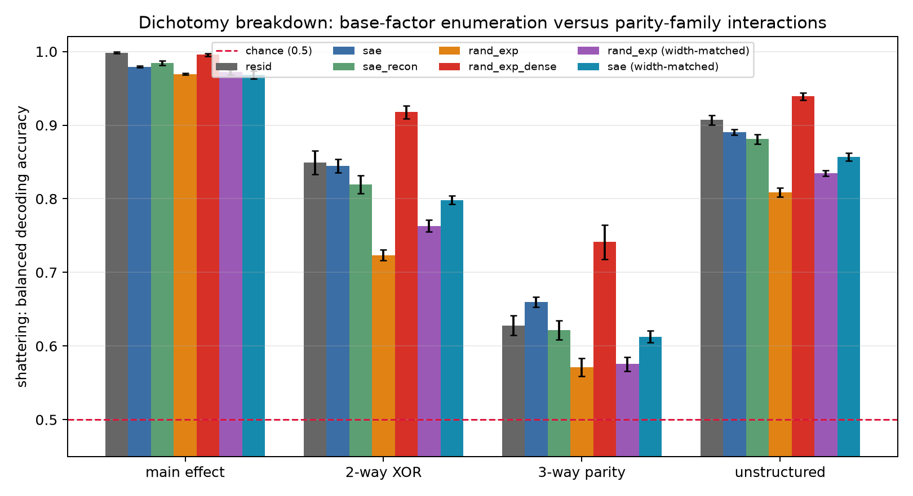

# Experiment 03 — Shattering dimensionality × CCGP on GPT-2-small SAE features

**Code:** `ccgp_sae.py` (offline CPU; five seeds). **Raw result:** `results.json`. **Figures:** `figures/`.

`results.json` uses schema `exp03-results-v3`. It records every primary per-seed row as `{probe_setting, seed, arm, sd, ccgp, gap, selected_weight_decay_by_outer_fold, inner_validation_l2_selection}` plus the per-seed matching metadata and both effective-width contrasts. `ci95 = 1.96 × sample_sd / sqrt(n)` across five seeds. The primary summary uses the global-RMS probe described below; the pre-control fixed-L2 run remains a labelled sensitivity baseline.

## The question

Experiment 02's monosemantic arm was coordinate-wise *and* a compression. Its theorem-backed XOR failure therefore does not extrapolate to a real sparse autoencoder. Here GPT-2's residual stream is 768-wide while the SAE encoder is a 24,576-wide ReLU expansion: width alone can improve linear separability.

The informative comparison is consequently not `sae` versus `resid`. It is a sparse SAE code versus a random ReLU expansion matched in encoder scale and mean active-feature count (L0). Sparse-factor pressure could favour clean factor coding; conjunctive SAE features could instead favour interaction readout. A null is as informative as an edge.

The reviewer’s remaining alternative was more specific: even with L0 matched, the SAE could win merely because more distinct directions ever fire across the stimulus set. The original sparse arms had about 794 SAE versus 503 random surviving units. This run therefore adds both directions of effective-width matching: a widened random expansion, calibrated only on surviving width, and a randomly narrowed SAE. The latter is exact per seed and necessarily lowers SAE L0; that loss is reported rather than hidden.

## Scope: this is a lens, not a model intervention

An SAE is a read-out lens hung beside the residual stream. GPT-2's downstream components continue to read the original mixed residual stream: this experiment never substitutes SAE features into the forward computation, ablates them, or measures a change in model behaviour. Therefore every score below is a property of a code under these probes, not evidence that an SAE harms, degrades, removes, or loses computation used by the model.

## Setup

| arm | representation | role |
|---|---|---|
| `resid` | GPT-2 residual activation `x` | mixed-code reference |
| `sae` | `ReLU((x − b_dec) @ W_enc + b_enc)` | research object |
| `sae_recon` | `f @ W_dec + b_dec` | round-trip control |
| `rand_exp` | random ReLU expansion with per-sample top-k | original width/norm/L0-matched sparse control |
| `rand_exp_dense` | the same random expansion without top-k | dense upper reference, not the primary control |
| `rand_exp_width_matched` | widened random top-k expansion | matches SAE surviving width as closely as the unlabeled column-count grid permits |
| `sae_width_matched` | uniform random subset of SAE-surviving latents | exactly matches `rand_exp` surviving width; its lower L0 is the cost |

Each lexical item instantiates NUMBER (singular/plural) × TENSE (past/present) × POLARITY (affirmative/negated):

```
The {ADJ} {NOUN} {AUX} {POL} {VERB} the {ADJ2} {OBJ} {ADV} .
```

The sentence-final `.` is the only read-out token. Do-support keeps the main verb bare, and `indeed`/`not` occupy the polarity slot. I probe neither the auxiliary nor the verb: that would read word form rather than a carried representation. Every retained item had equal GPT-2 token length and the identical final-token id across its eight cells; probes use item-disjoint splits, so a lexical draw cannot be in both train and test.

The full run used 96 items × 8 cells = 768 sequences per seed, five lexical/random/probe seeds, five item-disjoint folds, all 35 balanced dichotomies, and all 16 CCGP held-condition splits. The primary probe centres on each training split then divides every surviving unit by one **global training-RMS scalar**. For each arm and outer fold it selects AdamW L2 from `{0.01, 0.03, 0.08, 0.2, 0.5}` using an item-disjoint inner validation subset of the outer training items, scored on the three main effects; the outer test items are never used for selection.

## Gates A–C

The run used `/Users/linghao/Github/mech-interp-lab/.venv/bin/python` on CPU with `HF_HUB_OFFLINE=1`, `TRANSFORMERS_OFFLINE=1`, and `MPLBACKEND=Agg`. GPT-2 small resolved from the local Hugging Face cache. The SAE was loaded directly from the published `jbloom/GPT2-Small-SAEs-Reformatted` res-jb safetensors; `sae_lens` was not installed or used.

| gate | measured result | decision |
|---|---|---|
| A: loading | layer-8 SAE: across-stimulus-centred EV **−0.660** *(not standard SAE EV; see note)*, MSE 1.086, relative reconstruction error 0.286, mean L0 71.87 | pass |
| B: stimuli and base factors | all five seeds retained 96/96 items; 0 dropped; pilot NUMBER / TENSE / POLARITY accuracy at layers 6–9 was 0.993–1.000 | pass; layer 8 selected |
| C: headroom | residual two-way-XOR SD = 0.827, below the 0.98 saturation threshold | pass |

The across-stimulus-centred denominator contains only variation across this deliberately narrow stimulus set, so its value is negative even though the directly measured relative reconstruction error is 0.286. It is not standard SAE reconstruction EV. Layer-8 pilot main-effect accuracies were NUMBER 1.000, TENSE 1.000, and POLARITY 0.996; the other pilot layers were 6: 0.993 / 0.999 / 1.000, 7: 0.999 / 1.000 / 0.995, and 9: 0.999 / 1.000 / 0.995.

## Result 1 — the two-way-XOR edge survives effective-width matching, but the old +0.121 is not the headline


Caption — the left panel retains the 0.5 chance lines; the right panel zooms the observed range so arm separation is legible. The x-axis is **main-effect CCGP**, not pooled overall CCGP. The original un-width-matched `sae − rand_exp` two-way-XOR edge was **+0.121 ± 0.011**. Matching effective width shrinks it to **+0.081 ± 0.006** when random usage is widened and **+0.075 ± 0.011** when the SAE is narrowed. Thus the un-matched magnitude does not survive, but a positive interaction-readout edge does in both directions of matching.

| arm | overall SD | main-effect SD | main-effect CCGP | overall train − test gap |
|---|---:|---:|---:|---:|
| `resid` | 0.902 ± 0.006 | 0.998 ± 0.001 | 0.953 ± 0.006 | +0.092 ± 0.006 |
| `sae` | 0.888 ± 0.004 | 0.979 ± 0.001 | 0.918 ± 0.006 | +0.111 ± 0.004 |
| `sae_recon` | 0.877 ± 0.007 | 0.984 ± 0.003 | 0.952 ± 0.005 | +0.084 ± 0.005 |
| `rand_exp` | 0.809 ± 0.006 | 0.969 ± 0.001 | 0.909 ± 0.008 | +0.189 ± 0.005 |
| `rand_exp_dense` | 0.936 ± 0.005 | 0.996 ± 0.002 | 0.929 ± 0.005 | +0.063 ± 0.005 |
| `rand_exp_width_matched` | 0.833 ± 0.004 | 0.972 ± 0.003 | 0.899 ± 0.007 | +0.167 ± 0.003 |
| `sae_width_matched` | 0.854 ± 0.005 | 0.968 ± 0.006 | 0.903 ± 0.007 | +0.135 ± 0.005 |

The figure coordinates are `(main-effect CCGP, overall SD)`. Its full-scale panel includes chance, while the zoom panel makes the primary separation readable without hiding the baseline. Overall CCGP remains table-only: it is 0.500 ± 0.000 for every arm at this precision because 28 of 35 dichotomies have no abstract structure to transfer.

## Result 2 — the interaction result is not a base-factor mismatch in the exact narrow-SAE control



Caption — the dense random arm has the most shattering, as expected for an unsparsified high-dimensional random expansion. The relevant evidence is the L0-matched sparse comparison and its effective-width controls, not that dense upper reference.

| arm | main-effect SD | two-way XOR SD | three-way parity SD | unstructured SD |
|---|---:|---:|---:|---:|
| `resid` | 0.998 ± 0.001 | 0.849 ± 0.016 | 0.625 ± 0.013 | 0.907 ± 0.007 |
| `sae` | 0.979 ± 0.001 | 0.845 ± 0.009 | 0.660 ± 0.006 | 0.889 ± 0.004 |
| `sae_recon` | 0.984 ± 0.003 | 0.819 ± 0.012 | 0.620 ± 0.014 | 0.877 ± 0.007 |
| `rand_exp` | 0.969 ± 0.001 | 0.723 ± 0.007 | 0.571 ± 0.012 | 0.807 ± 0.006 |
| `rand_exp_dense` | 0.996 ± 0.002 | 0.918 ± 0.009 | 0.740 ± 0.024 | 0.941 ± 0.005 |
| `rand_exp_width_matched` | 0.972 ± 0.003 | 0.763 ± 0.008 | 0.576 ± 0.010 | 0.834 ± 0.004 |
| `sae_width_matched` | 0.968 ± 0.006 | 0.798 ± 0.006 | 0.613 ± 0.008 | 0.857 ± 0.005 |

Within-seed primary contrasts are:

| comparison | overall SD | main-effect SD | two-way-XOR SD |
|---|---:|---:|---:|
| un-matched `sae − rand_exp` | +0.079 ± 0.006 | +0.010 ± 0.002 | +0.121 ± 0.011 |
| widened-random `sae − rand_exp_width_matched` | +0.055 ± 0.006 | +0.007 ± 0.003 | **+0.081 ± 0.006** |
| narrowed-SAE `sae_width_matched − rand_exp` | +0.046 ± 0.007 | **−0.001 ± 0.006** | **+0.075 ± 0.011** |

The exact narrowed-SAE match removes the main-effect difference while retaining the two-way-XOR edge. Together, the controls support the limited interpretation that the SAE's interaction-readout advantage on these stimuli is not explained solely by having more distinct active directions. They do **not** identify which learned SAE property supplies that advantage, and they say nothing about downstream GPT-2 computation.

## Effective-width controls and matching

The widened random arm keeps residual `b_dec` centring, draws encoder-column norms and encoder biases from the SAE's empirical distributions, and uses the SAE-derived top-k (71 or 72) on every sample. Its nominal column count is selected only by unlabeled surviving width, never by a factor label, dichotomy, or probe score. The coarse column-count grid reached a close mean match (772.6 random versus 794.2 SAE surviving units), not an exact match on every seed; the exact narrow-SAE control supplies the reciprocal test.

| seed | SAE width → widened-random width (nominal columns; L0) | random width → narrowed-SAE width (narrowed SAE L0) |
|---:|---|---|
| 0 | 797 → 794 (168,856; 72.00) | 464 → 464 (42.23) |
| 1 | 802 → 740 (231,765; 72.00) | 489 → 489 (44.65) |
| 2 | 785 → 760 (244,446; 72.00) | 513 → 513 (48.01) |
| 3 | 803 → 777 (194,166; 72.00) | 559 → 559 (48.70) |
| 4 | 784 → 792 (236,412; 71.00) | 489 → 489 (41.25) |

The baseline sparse arms retain their original L0 match: SAE mean 71.80 (range 70.55–72.35) versus random mean 71.80 (71–72 exactly). The dense random reference has mean L0 12,085.70 (range 11,997.10–12,155.37). `resid` and `sae_recon` have width 768 every seed; `rand_exp_dense` has width 19,986–20,248.

`rand_exp_dense` beats every other arm (overall SD 0.936; two-way-XOR SD 0.918) because it leaves about 12,000 random ReLU coordinates active per sample. That is the high-dimensional random-expansion outcome Cover's theorem makes unsurprising. It is precisely why the sparse L0-matched arm — and now the effective-width controls around it — carry the argument; dense random is an upper reference, not evidence against the SAE.

## Why global RMS is the primary probe

Global RMS is primary on principle, not because it gives the more interesting ordering. An SAE decoder and any consumer of its code receive **raw latent activations**: relative magnitude across latents is part of that representation. Per-feature z-scoring erases those relative magnitudes, inflates rare units, and creates a code that neither the SAE decoder nor a downstream consumer ever reads. Centre each training split to remove a probe-intercept nuisance, then divide by one global training-RMS scalar to remove arbitrary overall units while preserving relative latent scale.

The sensitivity table remains useful because the conclusion is probe-sensitive. Nested L2 selection alone leaves the z-score ordering nearly unchanged; changing the scale convention changes it. That is evidence that per-feature standardisation changes the representation being read, not a reason to choose a setting after seeing its outcome.

| probe setting | arm | overall SD | main-effect SD | main-effect CCGP | overall train − test gap |
|---|---|---:|---:|---:|---:|
| fixed L2 0.08, per-feature z-score (legacy) | `resid` | 0.901 ± 0.007 | 0.998 ± 0.001 | 0.947 ± 0.004 | +0.093 ± 0.006 |
|  | `sae` | 0.716 ± 0.013 | 0.787 ± 0.014 | 0.731 ± 0.009 | +0.284 ± 0.013 |
|  | `sae_recon` | 0.876 ± 0.007 | 0.983 ± 0.003 | 0.946 ± 0.005 | +0.092 ± 0.005 |
|  | `rand_exp` | 0.731 ± 0.010 | 0.860 ± 0.009 | 0.803 ± 0.011 | +0.268 ± 0.010 |
|  | `rand_exp_dense` | 0.810 ± 0.003 | 0.937 ± 0.006 | 0.859 ± 0.007 | +0.190 ± 0.003 |
| nested L2, per-feature z-score | `resid` | 0.901 ± 0.006 | 0.998 ± 0.001 | 0.955 ± 0.007 | +0.093 ± 0.006 |
|  | `sae` | 0.718 ± 0.014 | 0.790 ± 0.015 | 0.735 ± 0.007 | +0.282 ± 0.014 |
|  | `sae_recon` | 0.877 ± 0.007 | 0.984 ± 0.004 | 0.951 ± 0.005 | +0.087 ± 0.006 |
|  | `rand_exp` | 0.731 ± 0.010 | 0.860 ± 0.010 | 0.805 ± 0.011 | +0.267 ± 0.010 |
|  | `rand_exp_dense` | 0.814 ± 0.002 | 0.940 ± 0.005 | 0.864 ± 0.005 | +0.186 ± 0.002 |
| nested L2, **global RMS** (primary) | `resid` | 0.902 ± 0.006 | 0.998 ± 0.001 | 0.953 ± 0.006 | +0.092 ± 0.006 |
|  | `sae` | 0.888 ± 0.004 | 0.979 ± 0.001 | 0.918 ± 0.006 | +0.111 ± 0.004 |
|  | `sae_recon` | 0.877 ± 0.007 | 0.984 ± 0.003 | 0.952 ± 0.005 | +0.084 ± 0.005 |
|  | `rand_exp` | 0.809 ± 0.006 | 0.969 ± 0.001 | 0.909 ± 0.008 | +0.189 ± 0.005 |
|  | `rand_exp_dense` | 0.936 ± 0.005 | 0.996 ± 0.002 | 0.929 ± 0.005 | +0.063 ± 0.005 |

The primary 100-step versus 200-step diagnostic changes inner-validation main-effect accuracy by at most 0.0033 for any original arm (SAE: 0.976 ± 0.007 at 100 versus 0.973 ± 0.007 at 200; sparse random: 0.966 ± 0.010 versus 0.963 ± 0.010), while training BCE continues to fall slightly. Thus 100 steps is adequate for the reported validation accuracy at this precision, though not literally at zero optimizer loss.

## What actually ran

The complete five-seed run, including both effective-width controls, completed in **1,190.8 seconds (19 minutes 50.8 seconds)** on CPU. It ran global-RMS nested-L2 SD and all-35-dichotomy CCGP for all seven primary arms, plus the original five-arm nested-L2 z-score sensitivity analysis. `SMOKE=1` completed in **84.2 seconds** using its documented two-seed / 24-item / two-fold / 2-of-16-split subset; it is a plumbing check, not a result.

No package was installed and no script that writes into experiments 01 or 02 was run. I therefore did not re-run Experiment 02's requested smoke check: the present task explicitly forbids writes there.

## Caveats

- The widened-random control is close in mean active width but not exact on every seed; its result agrees in direction with, but should not be conflated with, the exact narrowed-SAE control.
- Narrowing the SAE exactly matches random effective width but lowers mean SAE L0 from 71.80 to 44.97. That is the stated cost of this matching direction, not a hidden equivalence claim.
- These controls reject a simple “more active directions alone” account on this template family. They do not identify conjunctive features directly, prove a mechanism, or establish the result for every SAE, layer, or language distribution.
- This is a property of five lexical draws from one controlled English template, not a claim about all GPT-2 representations or language understanding.
- CCGP and shattering describe code geometry under linear probes. They do not identify a transformer circuit, causal feature use, or a behavioural effect.
- The only theorem cited by this project remains Experiment 02's coordinate-wise compression/XOR result. Nothing trained or measured here earns that label.

## Next

- Inspect which SAE latents account for the surviving width-matched interaction margin, with a preregistered feature-family test rather than post-hoc examples.
- Add diverse templates and stimulus families, then test whether the width-matched result survives lexical and syntactic changes.
- Use SAE features for a circuit-level or intervention study only with an explicit causal design; this representation-only experiment does not answer that question.
